# 🏥 MediTrackLite

**MediTrackLite** is a feature-rich full-stack **MERN** (MongoDB, Express.js, React.js, Node.js) based **clinic and appointment management system** with **role-based access** for **Admins**, **Doctors**, and **Patients**. It integrates modern features like a voice-enabled chatbot, real-time appointment flow, prescription management, theme switching, and more.

---

## 📌 Key Features

### 🔐 Role-Based Access

- **Admin**
- **Doctor**
- **Patient**

### 💬 Smart Voice Chatbot (MediBot)
- Integrated on all pages
- Supports **voice input and response**
- Answers categorized FAQs:
  - Booking appointments
  - Prescription download
  - Doctor approval status
- FAQ search with expandable FAQ drawer

### 🌓 Theme Switch
- Toggle between **Dark and Light mode**
- Persistent theme preference

### 💳  Payment Flow
- Frontend-only payment simulation
- Shows doctor & patient details
- Supports UPI, Debit, and Credit card UI
- Toast confirmation upon  payment

---

## 🌐 Public Pages

- Landing Page with Navbar
- Doctor/Patient Login
- Admin Login
- About Us
- Contact Page

---

## 🧑‍💼 Admin Dashboard

- View/manage all doctors:
  - ✅ Approved
  - 🕓 Pending Approval
- Approve or reject doctors
- Analytics:
  - Total counts (Doctors, Patients, Appointments)
  - Graphs and pie charts
- View/manage patient feedback
- Handle **feedback deletion requests**
- Chatbot assistance
- Logout

---

## 🧑‍⚕️ Doctor Dashboard

- View & edit profile (bio, specialization, timings, etc.)
- View and manage patient appointments
  - ✅ Approve / ❌ Reject
  - ⏳ Start Treatment (In-Progress)
  - 📜 Add Prescription (Complete)
- Toggle prescription visibility
- View feedback with **average rating**
- Dashboard analytics with pie chart
- **Request feedback deletion**
- Chatbot assistance
- Logout

---

## 👩‍💻 Patient Dashboard

- View & update profile
- Book appointments with **approved doctors**
  - Max **2 per day**
  - Past time slots hidden for current day
- Filter appointments by status:
  - Pending / Approved / In-Progress / Completed
- Download/view prescriptions (for completed)
- Submit feedback (once per completed appointment)
- View feedbacks submitted
- **Request feedback deletion**
- View doctors on “My Doctors” page
- Chatbot assistance
- Logout

---

## 📅 Appointment Workflow

1. Patient fills appointment form → redirected to **Fake Payment Page**
2. After successful payment → appointment saved with "Pending"
3. Doctor approves/rejects
4. If approved:
   - Doctor starts treatment → status: **In-Progress**
   - Doctor adds prescription → status: **Completed**
5. Patient can download prescription
6. Patient submits feedback

---

## 📊 Analytics (Admin & Doctor)

### Admin:
- Bar Graphs: Total Patients, Doctors, Appointments
- Pie Chart: Doctor Specializations
- Feedback Trends

### Doctor:
- Pie Chart: Appointment status
- Ratings overview

---

## 🛠️ Tech Stack

| Tech                  | Role                        |
|-----------------------|-----------------------------|
| **MongoDB**           | Database                    |
| **Express.js**        | Backend Framework           |
| **React.js**          | Frontend UI                 |
| **Node.js**           | Server Runtime              |
| **Axios**             | API Requests                |
| **JWT**               | Auth Token System           |
| **Multer**            | File Upload (Profile Pics)  |
| **Bootstrap + CSS**   | Responsive Styling          |
| **Speech Synthesis**  | Voice-enabled Chatbot       |
| **Chart.js / Recharts**| Dashboard Charts           |

---

## 📁 Project Structure

```
MediTrackLite/
├── client/         # React Frontend
├── server/         # Express Backend
├── screenshots/    # UI Snapshots
├── README.md
```

---

## 🚀 Getting Started

### 🔧 Prerequisites

- Node.js (v16+)
- MongoDB (local or Atlas)

### 🔩 Installation & Run

```bash
# Clone the repo
git clone https://github.com/N-Manisha-05/MediTrackLite.git
cd MediTrackLite

# Install backend
cd server
npm install
node server.js

# Install frontend
cd ../client
npm install
npm start
```

---

## 📷 Screenshots 

### 🏠 Home Page


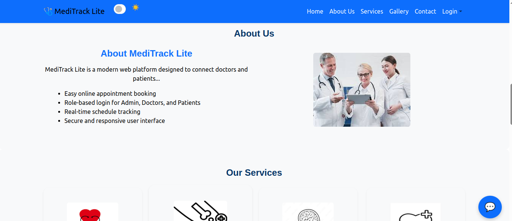


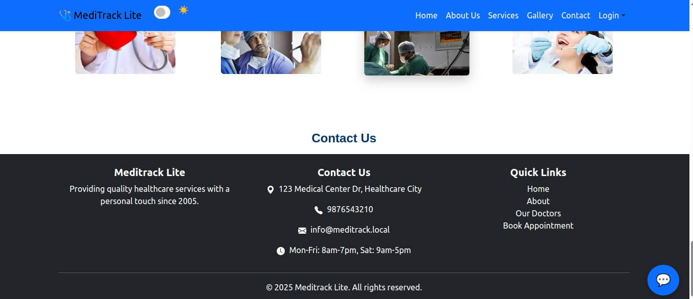

### 🔐 Login Pages


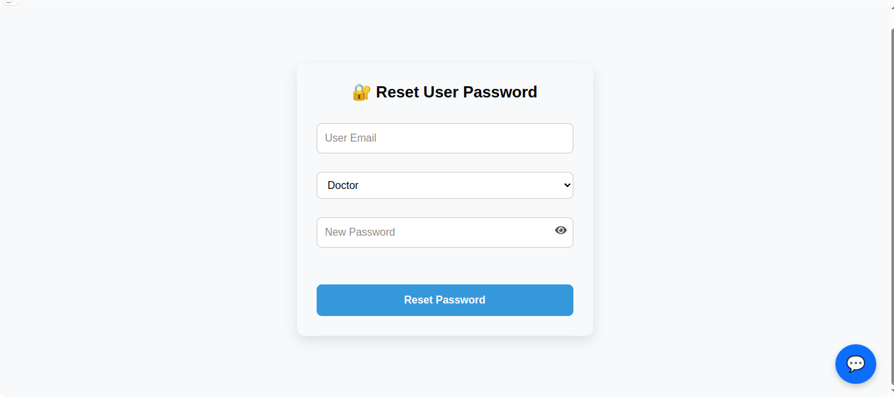
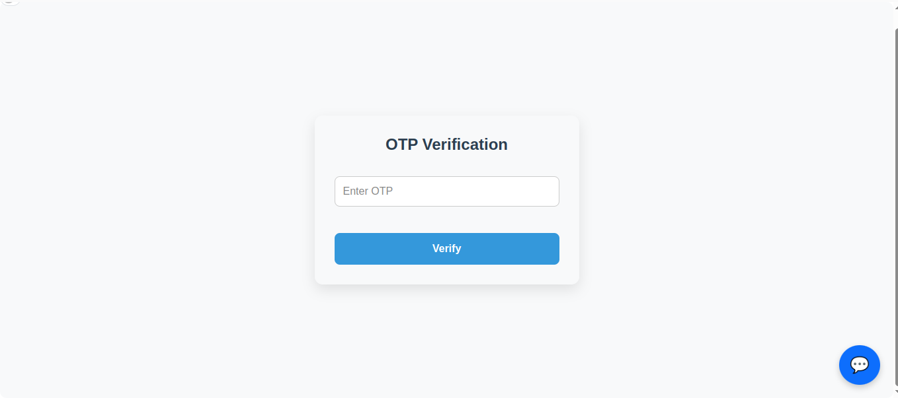

### 🧑‍💼 Admin Dashboard
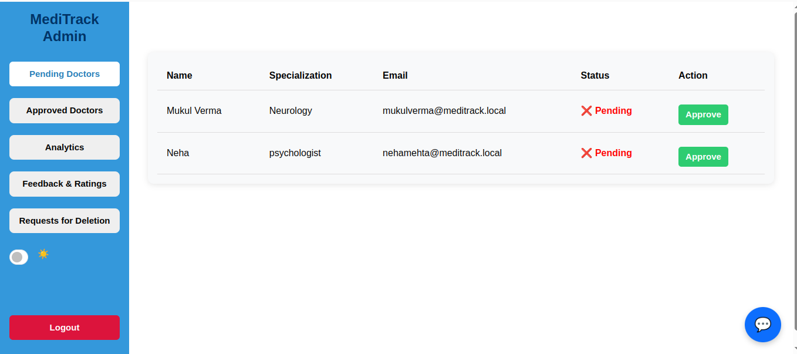


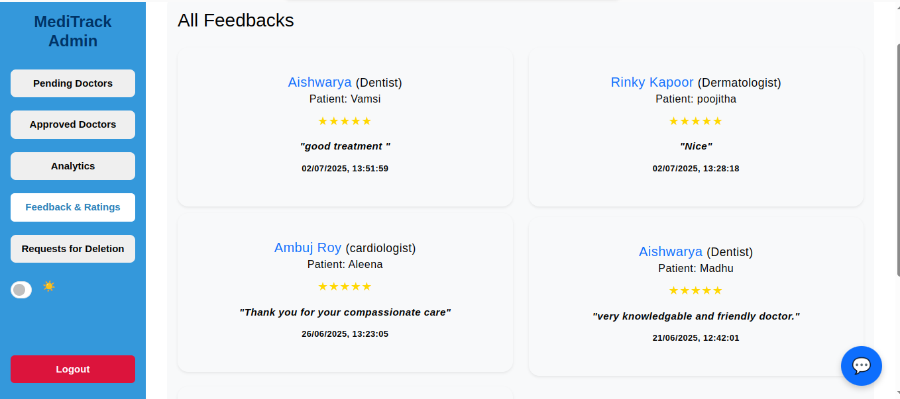
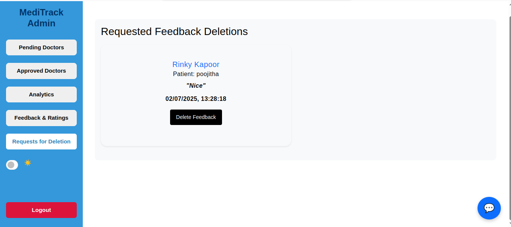

### 🧑‍⚕️ Doctor Dashboard
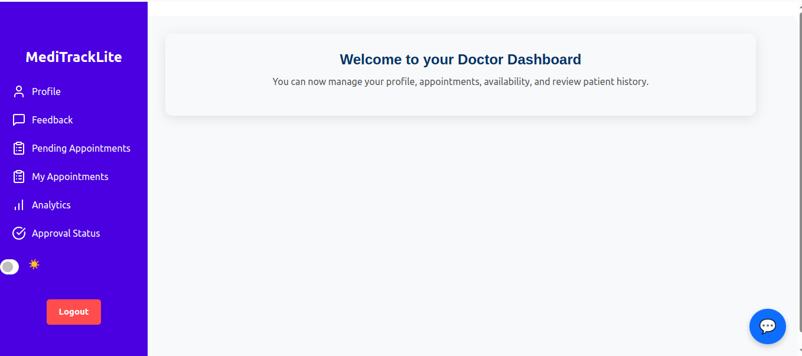

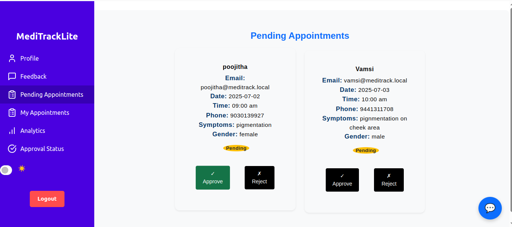


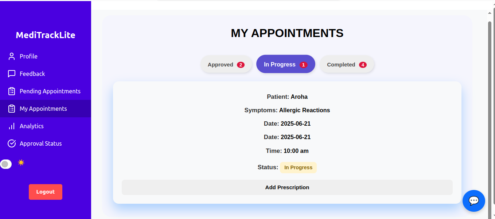
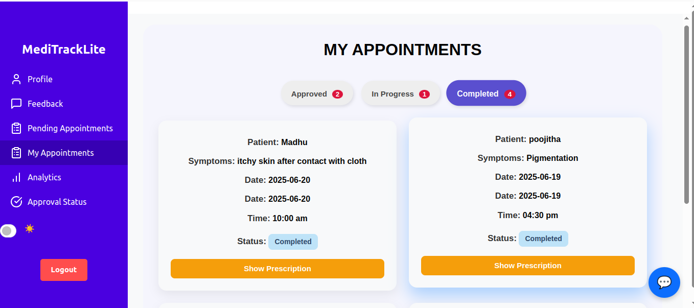
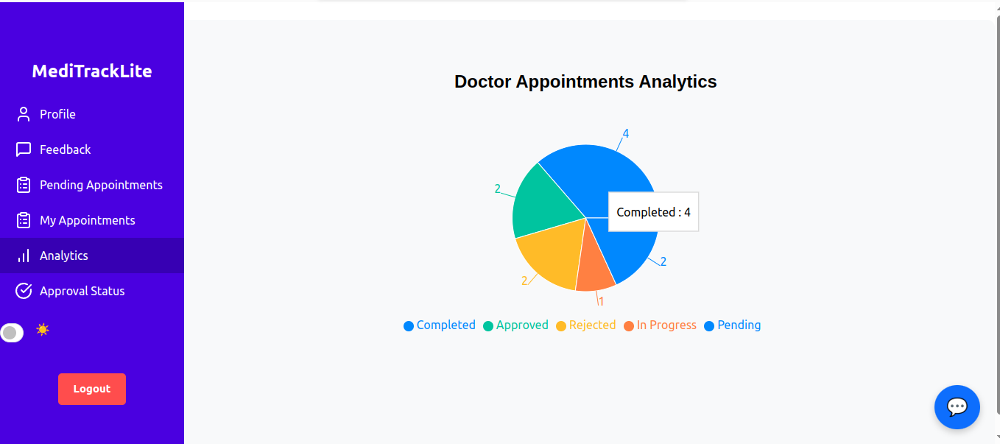
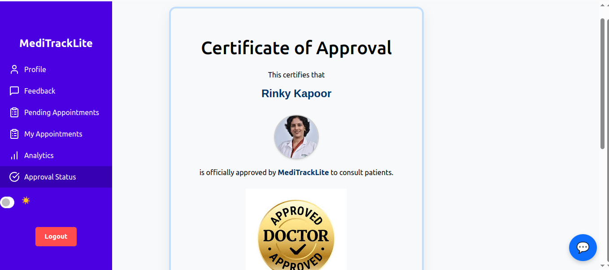
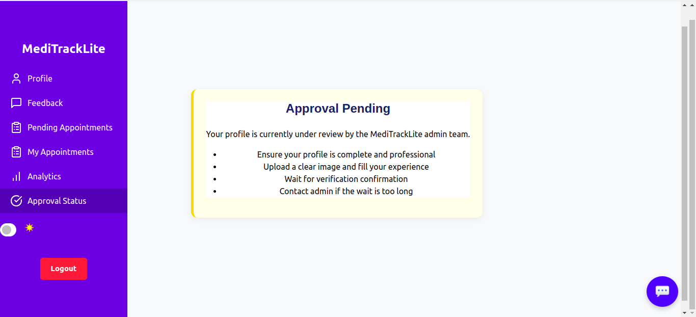

### 👩‍💻 Patient Dashboard
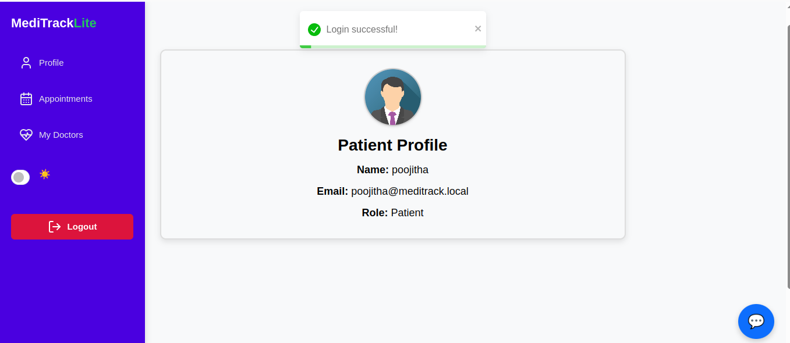
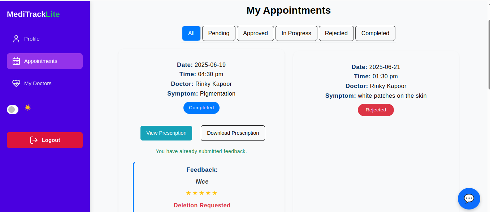


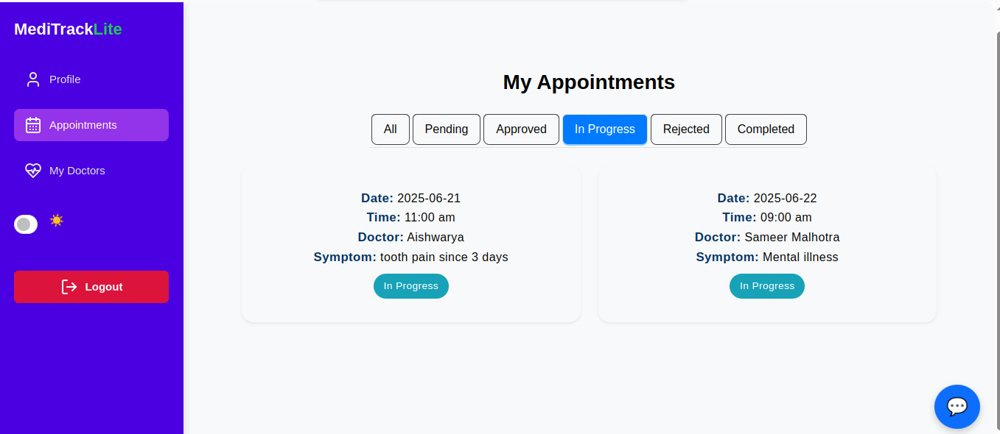

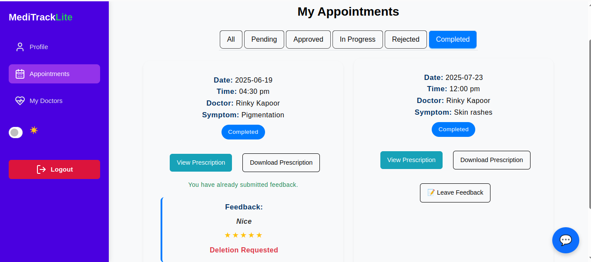
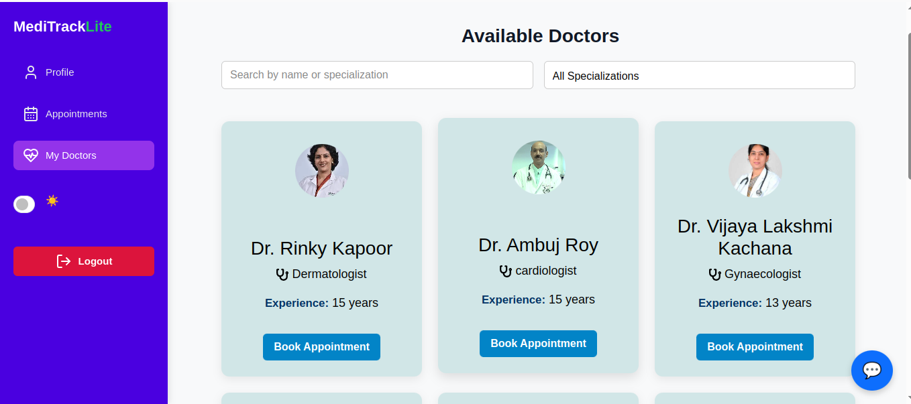


### 📅 Appointment Booking
.png)
.png)
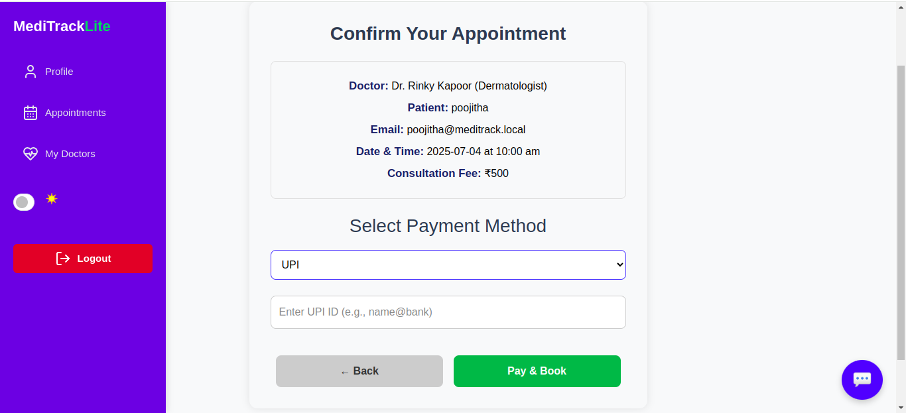


### 💬 Smart Chatbot
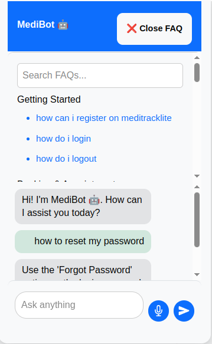
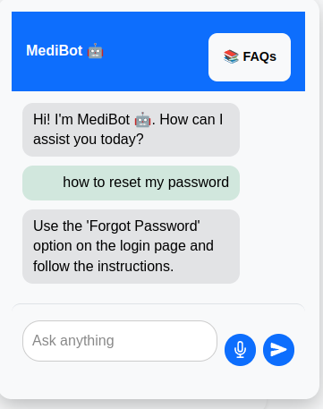

### Dark Theme
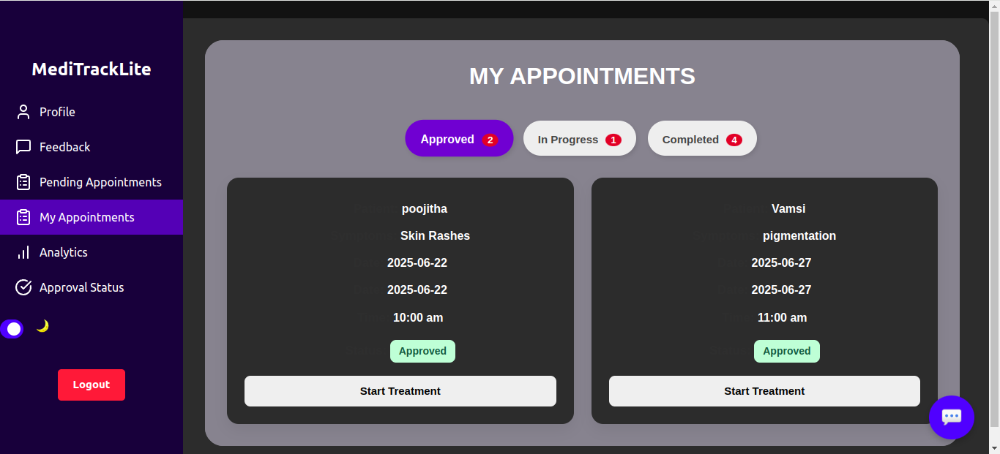

---


## 🤝 Contributing

Pull requests are welcome. Fork the repo, make changes, and raise a PR.

---


